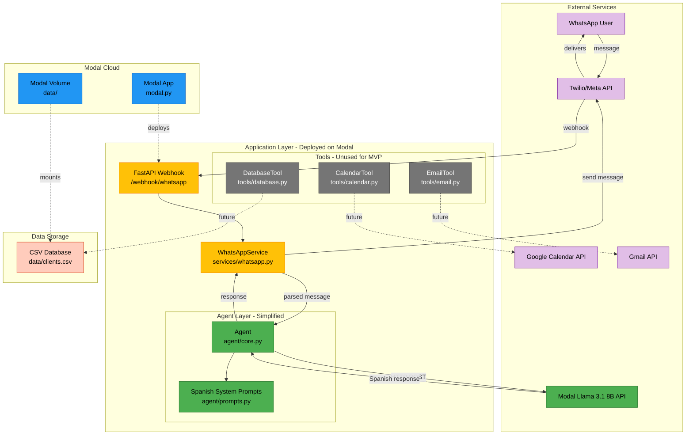
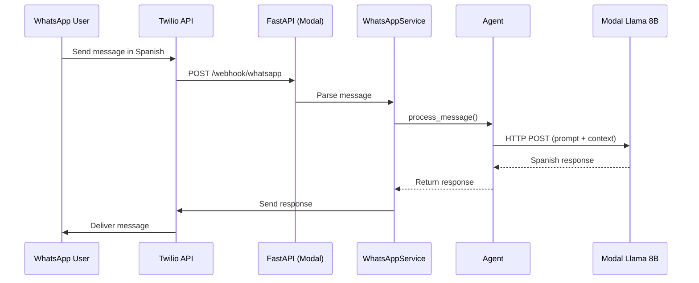

# WhatsApp Assistant - Architecture (MVP)

## System Architecture



**Legend:**
- 🟢 **Green** - New/Modified components (Modal integration)
- 🔵 **Blue** - Modal infrastructure
- 🟡 **Yellow** - FastAPI layer (unchanged)
- ⚫ **Gray** - Tools (kept for future, not used in MVP)
- 🟣 **Purple** - External services
- 🟠 **Orange** - Data storage

---

## Message Flow



---

## File Structure

```
whatsup_assistant/
├── modal.py                   # NEW: Modal deployment config
├── requirements.txt           # MODIFY: Remove langchain/openai, add modal
├── architecture.md            # NEW: This file
├── implementation.md          # Plan document
│
└── src/
    ├── main.py               # UNCHANGED: FastAPI app
    │
    ├── agent/
    │   ├── core.py          # REWRITE: Simple Modal API calls
    │   └── prompts.py       # UPDATE: Spanish prompts
    │
    ├── services/
    │   └── whatsapp.py      # UNCHANGED: Message handling
    │
    ├── tools/               # KEEP: Not used in MVP
    │   ├── calendar.py      # (future use)
    │   ├── email.py         # (future use)
    │   └── database.py      # (future use)
    │
    └── data/
        └── clients.csv      # Client database
```

---

## Component Responsibilities

| Component | Responsibility | Change Type |
|-----------|---------------|-------------|
| `modal.py` | Deploy FastAPI to Modal cloud | **NEW** |
| `agent/core.py` | Process messages via Modal API | **REWRITE** |
| `agent/prompts.py` | Spanish system prompts | **UPDATE** |
| `main.py` | FastAPI webhook endpoints | Unchanged |
| `services/whatsapp.py` | Parse/send WhatsApp messages | Unchanged |
| `tools/*.py` | Calendar/Email/DB operations | Keep for future |
| `requirements.txt` | Dependencies | **UPDATE** |

---

## Key Design Decisions

### No LangChain
- Direct HTTP calls to Modal API
- Simpler debugging and maintenance
- Less overhead, faster responses
- More control over behavior

### Llama 3.1 8B
- Cost-effective for MVP testing
- Good Spanish support
- Fast inference times
- Easy upgrade path to 70B

### Stateless Agent
- No conversation memory initially
- Simpler deployment on Modal
- Can add Redis/database later
- Focus on basic flow first

### Keep Existing Tools
- Already implemented
- No overhead if unused
- Easy to integrate later
- Manual tool calling when ready

---

## Implementation Impact

**Minimal Changes Required:**
1. Rewrite `agent/core.py` (~50 lines)
2. Update `agent/prompts.py` (~10 lines)
3. Create `modal.py` (~30 lines)
4. Update `requirements.txt` (~5 lines)

**Total: ~95 lines of code changes**

---

## Next Steps

1. Update `core.py` - Remove LangChain, add Modal API client
2. Update `prompts.py` - Add Spanish system prompt
3. Create `modal.py` - Define Modal app deployment
4. Update `requirements.txt` - Swap dependencies
5. Test locally with Modal API
6. Deploy to Modal
7. Configure WhatsApp webhook
8. Test end-to-end in Spanish

---

*Architecture designed for simplicity and rapid MVP validation.*
